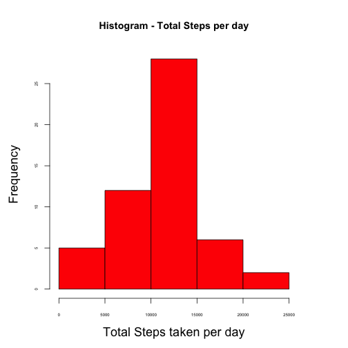
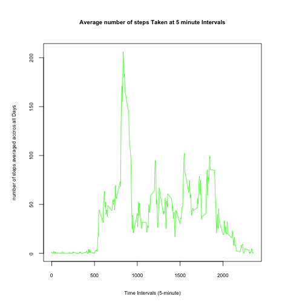
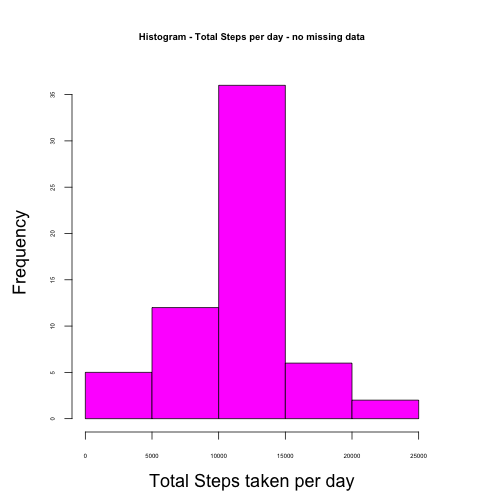
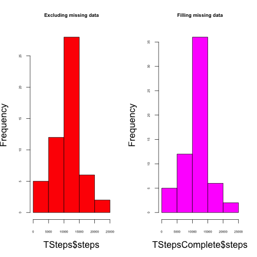
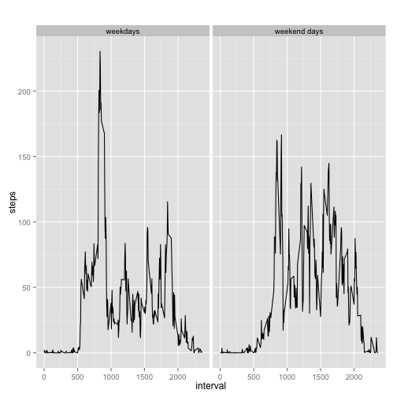

# Course Assignment

**Loading and preprocessing the data**

*Show any code that is needed to*

*- Load the data (i.e. read.csv())*

*- Process/transform the data (if necessary) into a format suitable for your     analysis*

  The code for reading the data, which is already included in this assignmet's   directory at Github is the following: 


```r
unzip("activity.zip", "activity.csv")
activity <- read.table("activity.csv", sep=",", header=T)
```


  Taking a first look at the data:

```r
head(activity)
```

```
##   steps       date interval
## 1    NA 2012-10-01        0
## 2    NA 2012-10-01        5
## 3    NA 2012-10-01       10
## 4    NA 2012-10-01       15
## 5    NA 2012-10-01       20
## 6    NA 2012-10-01       25
```

```r
tail(activity)
```

```
##       steps       date interval
## 17563    NA 2012-11-30     2330
## 17564    NA 2012-11-30     2335
## 17565    NA 2012-11-30     2340
## 17566    NA 2012-11-30     2345
## 17567    NA 2012-11-30     2350
## 17568    NA 2012-11-30     2355
```

```r
dim(activity)
```

```
## [1] 17568     3
```

```r
summary(activity)
```

```
##      steps                date          interval     
##  Min.   :  0.00   2012-10-01:  288   Min.   :   0.0  
##  1st Qu.:  0.00   2012-10-02:  288   1st Qu.: 588.8  
##  Median :  0.00   2012-10-03:  288   Median :1177.5  
##  Mean   : 37.38   2012-10-04:  288   Mean   :1177.5  
##  3rd Qu.: 12.00   2012-10-05:  288   3rd Qu.:1766.2  
##  Max.   :806.00   2012-10-06:  288   Max.   :2355.0  
##  NA's   :2304     (Other)   :15840
```


  Considering the assignment's steps, the first processing of data is the following: 


```r
TSteps <- aggregate(steps ~ date, data = activity, sum, na.rm = TRUE)
```


  Now some info on the processed data:


```r
head(TSteps)
```

```
##         date steps
## 1 2012-10-02   126
## 2 2012-10-03 11352
## 3 2012-10-04 12116
## 4 2012-10-05 13294
## 5 2012-10-06 15420
## 6 2012-10-07 11015
```

```r
tail(TSteps)
```

```
##          date steps
## 48 2012-11-24 14478
## 49 2012-11-25 11834
## 50 2012-11-26 11162
## 51 2012-11-27 13646
## 52 2012-11-28 10183
## 53 2012-11-29  7047
```

```r
dim(TSteps)
```

```
## [1] 53  2
```

```r
summary(TSteps)
```

```
##          date        steps      
##  2012-10-02: 1   Min.   :   41  
##  2012-10-03: 1   1st Qu.: 8841  
##  2012-10-04: 1   Median :10765  
##  2012-10-05: 1   Mean   :10766  
##  2012-10-06: 1   3rd Qu.:13294  
##  2012-10-07: 1   Max.   :21194  
##  (Other)   :47
```

**What is mean total number of steps taken per day?**


*Make a histogram of the total number of steps taken each day*


```r
par(mfrow=c(1,1), mar=c(5,5,5,5))
hist(TSteps$steps,col="red",main="Histogram - Total Steps per day",xlab="Total Steps taken per day",cex.axis=0.5,cex.lab = 1.5)
```

 


*Calculate and report the mean and median total number of steps taken per day*


```r
mean(TSteps$steps)
```

```
## [1] 10766.19
```

```r
median(TSteps$steps)
```

```
## [1] 10765
```


  The average number of steps taken each day is 10766.19
  The median number of steps per day is 10765.


  Unsurprisingly, we already knew these figures from the first look at the processed data. Through the summary() call, we were able to see the mean and median of steps. 


**What is the average daily activity pattern?**


*Make a time series plot (i.e. type = “l”) of the 5-minute interval (x-axis) and the average number of steps taken, averaged across all days (y-axis)*


  Here's the code for the task:
    
    

```r
par(mfrow=c(1,1), mar=c(5,5,5,5))

ISteps <- aggregate(steps ~ interval, data = activity, FUN="mean", na.rm = TRUE)

plot(steps ~ interval, data = ISteps, type = "l", xlab = "Time Intervals (5-minute)", ylab = "number of steps averaged accros all Days", main = "Average number of steps Taken at 5 minute Intervals",  col = "green", cex.axis=0.7,cex.lab = 0.7, cex.main = 0.8)
```

 


*Which 5-minute interval, on average across all the days in the dataset, contains the maximum number of steps?*


```r
MNumSteps <- ISteps[which.max(ISteps$steps),"interval"]
```


  Interval 835 contains the maximum number of average steps, which is 206.1698 steps.


**Inputing missing values**

*Calculate and report the total number of missing values in the dataset (i.e. the total number of rows with NAs)*


```r
missing_data <- sum(!complete.cases(activity))
```


  The total number of missing rows is 2304, as we already knew, based on the "summary(activity)", called earlier when we were exploring the dataset.

*Devise a strategy for filling in all of the missing values in the dataset. The strategy does not need to be sophisticated. For example, you could use the mean/median for that day, or the mean for that 5-minute interval, etc.*


  To me, it seems intuitive that the daily average steps per interval is a good estimate of the missing values. Due to that, we already have that number figured out in the ISteps object, which we create in order to obtain the interval average based on data from all days.


  This function returns the average steps for a given interval:


```r
getASPI <- function(interval){
  ISteps[ISteps$interval==interval,"steps"]
}
```


*Create a new dataset that is equal to the original dataset but with the missing data filled in.*
*Filling the missing values with the mean for that 5-minute interval.*


```r
complete.activity <- activity

obs = 0
for (i in 1:nrow(complete.activity)) {
  if (is.na(complete.activity[i,"steps"])) {
    complete.activity[i,"steps"] <- getASPI(complete.activity[i,"interval"])
    obs = obs + 1
  }
}
obs
```

  Analyzing the resulting object we see the following:


```r
summary(complete.activity)
```

```
##      steps                date          interval     
##  Min.   :  0.00   2012-10-01:  288   Min.   :   0.0  
##  1st Qu.:  0.00   2012-10-02:  288   1st Qu.: 588.8  
##  Median :  0.00   2012-10-03:  288   Median :1177.5  
##  Mean   : 37.38   2012-10-04:  288   Mean   :1177.5  
##  3rd Qu.: 27.00   2012-10-05:  288   3rd Qu.:1766.2  
##  Max.   :806.00   2012-10-06:  288   Max.   :2355.0  
##                   (Other)   :15840
```


  No more NAs, therefore, 2304 missing values were filled with the daily average for each interval. That number is the one returned in the "obs" object

*Make a histogram of the total number of steps taken each day.*


```r
par(mfrow=c(1,1), mar=c(5,5,5,5))

TStepsComplete <- aggregate(steps ~ date, data = complete.activity, sum, na.rm = TRUE)
hist(TStepsComplete$steps,col="magenta",main="Histogram - Total Steps per day - no missing data",xlab="Total Steps taken per day",cex.axis=0.5,cex.lab = 1.5, cex.main=0.8)
```

 


*Calculate and report the mean and median total number of steps taken per day.*


```r
mean(TStepsComplete$steps)
```

```
## [1] 10766.19
```

```r
median(TStepsComplete$steps)
```

```
## [1] 10766.19
```


  The average number of steps taken each day is 10766.19.
  The median number of steps per day now is also 10766.19.

*Do these values differ from the estimates from the first part of the assignment?*


  The average number of steps has not changed, which was expected due to the strategy utilized in order to fill the missing data (average of steps per intervall across all days). The median if different, though. It has increased to 10766.19 from 10765, being now equal to the average. 


*What is the impact of imputing missing data on the estimates of the total daily number of steps?*


  I believe comparing the histograms of total daily number of steps is a good way of performing this analysis:


 


  The concentration of days arround the mean increased to more than 35 from around 30. 
  We can check that with the following code:


```r
dim(subset(TSteps, steps>10000 & steps<15000)) # frequency of days within 10k and 15k steps in the original data set
```

```
## [1] 28  2
```

```r
dim(subset(TStepsComplete, steps>10000 & steps<15000)) # frequency of days within 10k and 15k steps in the data set with filled missing values
```

```
## [1] 36  2
```


**Are there differences in activity patterns between weekdays and weekends?**

*Create a new factor variable in the dataset with two levels - “weekday”“ and "weekend”“ indicating whether a given date is a weekday or weekend day.*


  Here is the code for creating the factors:


```r
complete.activity$day <- ifelse(as.POSIXlt(as.Date(complete.activity$date))$wday%%6 == 0, "weekend days", "weekdays")
complete.activity$day <- factor(complete.activity$day, levels = c("weekdays", "weekend days"))
```


*Make a panel plot containing a time series plot (i.e. type = "l”) of the 5-minute interval (x-axis) and the average number of steps taken, averaged across all weekday days or weekend days (y-axis).*


```r
library(ggplot2)

SIAP <-  aggregate(steps ~ interval + day, complete.activity, FUN="mean")

g <- ggplot(SIAP, aes(interval,steps))
g <- g + geom_line() + facet_grid(. ~ day) + labs(title=" ")
g
```

 


  We can see that there are differences in activity levels when comparing weekdays and weekends.


